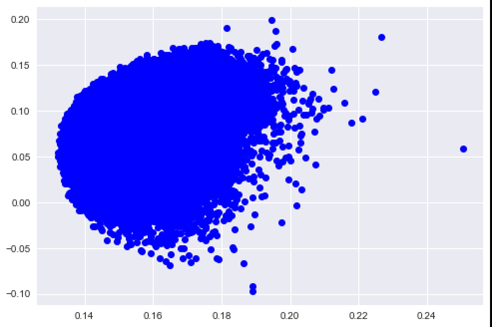
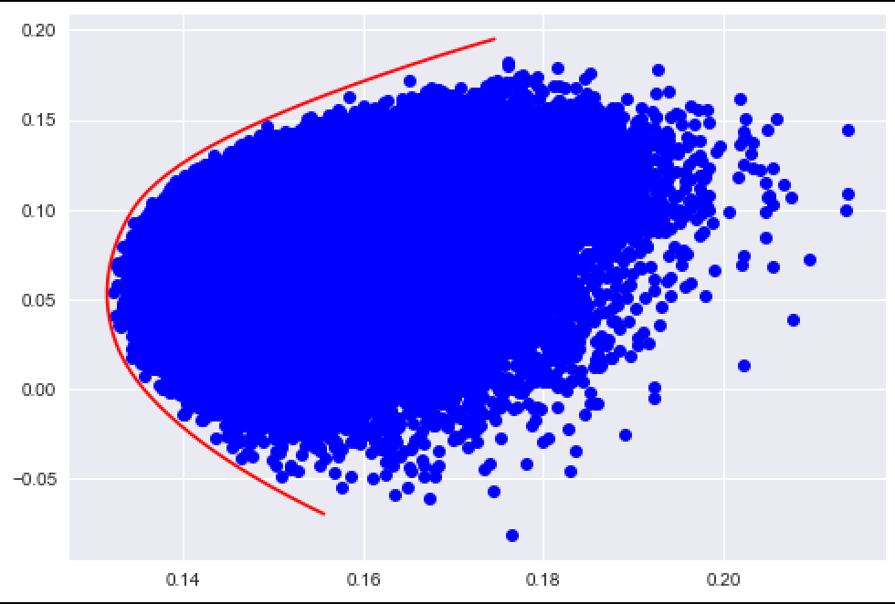
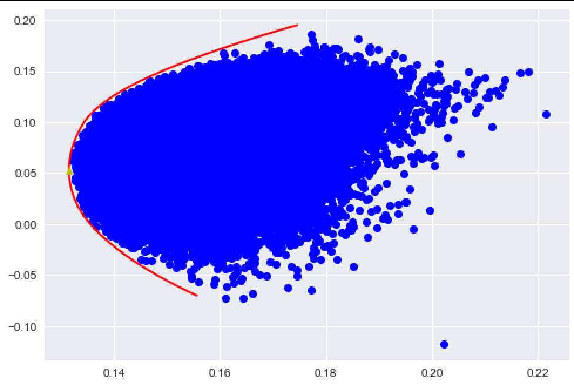

#Calculate Markowitz Efficient Frontier In Python


## Preparation
###PC
- Environment  
	
	python3.7
- packages    
	- pandas		    
	- numpy	
	- pandas_ datareader  	
	*we need to install pandas_datareader package by ourselves. Use the following instruction:*		
		`pip install pandas_datareader`		
		*or*	
		`conda install pandas_datareader`	
	- matplotlib.pyplot	
	- scipy	
	- datetime
	
- IDE  
	Anaconda Spyder	

###Finance
- Data source		
	Adjusted closing price from Yahoo Finance
- Stock Picthing		
	AAPL, TSM, COKE, V, GE, JNJ, T, BABA
- Formula
	- log return		
		
	- volatility		
		
	- portfolio expected return		
		
	- covariance of each stock 	
		
	- portfolio volatility		
		Here we can use matrix multiplication to calculate the portfolio variance. First we assume a weight vector , then we can use  to get the volatility.
		
## Realization
###
>The efficient frontier is the set of optimal portfolios that offers the highest expected return for a defined level of risk or the lowest risk for a given level of expected return. Portfolios that lie below the efficient frontier are sub-optimal because they do not provide enough return for the level of risk. Portfolios that cluster to the right of the efficient frontier are also sub-optimal because they have a higher level of risk for the defined rate of return.   
>             --by Investopedia

we can produce different expected return and volatility of portfolio by different weight combinations of securities. By simulating imaginary combinations of portfolios(we assume 200000 different weight combination in this case), we can get the feasible region of portfolios. By solving the optimal solution(minimum volatility) given specific expected return, we can get the minimum-variance frontier of feasible region. At last, we need to calculate the global minimum-variance, and those sets which lie above the global munimum-variance are the efficient frontier.

- **Step1 get the historical data from Yahoo finance**  
	
	- import packages
	
	```
	import pandas as pd
	import numpy as np
	import pandas_datareader.data as web
	import matplotlib.pyplot as plt
	import scipy.optimize as solver
	import datetime as dt
	from functools import reduce
	```
	
	- use pandas_datareader to get the close price data from Yahoo finance giving the stock tickets and date
	
	```
	Closeprice = pd.DataFrame()
	tickers = ['AAPL','TSM','COKE','V','GE','JNJ','T','BABA']
	for i in tickers:
    	tmp = web.DataReader(i, 'yahoo', '1/1/2010', dt.date.today())
    	Closeprice[i] = tmp['Adj Close']
    ```
    
- **Step2 Calculate the annualized rate of return, covariance and standard deviation(volatility) of portfolio**
	- calculate the log return

	`returns = np.log(Closeprice / Closeprice.shift(1))`
	
	- get the mean return and covariance matrix of each security from the DataFrame object and annualize.

	```
	##returns is a dataframe class
	mean = returns.mean() * 252
	cov = returns.cov() * 252
	```
	- calculate the expected return and volatility of portfolio

	```
	sum(mean * w)
	np.sqrt(reduce(np.dot, [w, cov, w.T]))
	```
	
	numpy.dot is a function to calculte the matrix multiplication;  
	reduce(function, sequence[, initial]) is a built-in function in python2, if you are in python3 where reduce() has been moved to functools, please use `from functools import reduce` to import and use it. In this case, the function is to use numpy.dot function to calculate "w*cov" first and then use the same function to calculate the previous result and w.T, where w is the portfolio weight and w.T is the matrix transpose. Actually that is equivalent to variance formulan.
	
	- simulate different weight portfolios and plot the feasible region
	
	```
	for _ in range(200000):
    	w = np.random.rand(l)
    	w /= sum(w)
    	rtn.append(sum(mean * w))
    	sds.append(np.sqrt(reduce(np.dot, [w, cov, w.T])))
	plt.plot(sds, rtn, 'ro') 
	```
	use the above method to get 200000 different weight combination (weights sum up to 1 in each combination) and calculate expected return and volatility in each portfolio. Then we can plot the risk-return spectrum.  
	
	
- **Step3 Calculate the minimum-variance curve**  
	Obviously, the minimum-variance frontier is the left boundary of feasible region. We can use minimize() function in scipy.optimize module to get the lowest volatility given expected return.   
	
	```
def sd(w):
    	return np.sqrt(reduce(np.dot, [w, cov, w.T]))  
x0 = np.array([1.0 / l for x in range(l)])  
bounds = tuple((0, 1) for x in range(l))  
given_r = np.arange(-.07, .20, .005)  
risk = []  
for i in given_r:  
    	constraints = [{'type': 'eq', 'fun': lambda x: sum(x) - 1},
                   {'type': 'eq', 'fun': lambda x: sum(x * mean) - i}]
    	outcome = solver.minimize(sd, x0=x0, constraints=constraints, bounds=bounds)  
    	risk.append(outcome.fun)  
plt.plot(risk, given_r, 'r-x')  
	```
	
	Then we have the following result  
	  
- **Step4 Calculate the global-minimum variance**    
	Because we need to get the global minimum variance which has only one return and the lowest volatility, we keep one constrain `constraints = {'type': 'eq', 'fun': lambda x: sum(x) - 1}` and get the result in the same way.   
	  
	We get the efficient frontier now. It is the red curve part  which lies above the white point(the global minimum variance).
	
	


	
	


